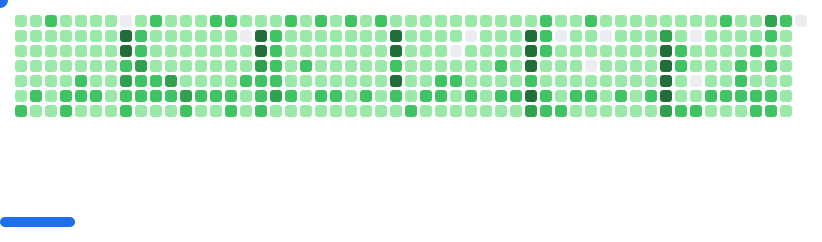

  

 
   

 
  <strong> 
        🚀 Passionate about technology and software development. 
  </strong>  

 
    <strong>  
        🎓 I am a Systems Engineering student at Universidad Fidélitas in Costa Rica, constantly learning and improving my skills.  
    </strong>  

 
    <strong>
        💻 Interested in building efficient, scalable, and modern software solutions.  
    </strong>  

### 🌐 Connect with me:

---

### 🗂 Projects Portfolio
Here you can explore all my projects and work:  
- ✨ **Development Project:** [Portfolio](https://myportfolio.com)  

---

### 💻 Programming Languages

  

### 🌐 Frontend

  

### ⚙️ Backend

  

### 🔍 API Testing & Development

  

### 🗄️ Databases

  

### 🛠️ IDEs & Tools

  

---

### 📚 Currently Learning
- 🌐 **Oracle Cloud Infrastructure (OCI)**  
- 🐧 **Linux administration & scripting**  
- 🐳 **Docker & containerization**  

---

### 📊 GitHub Stats
<table align="center"> 
<tr border="none">
<td width="50%" align="center">
 
  

</td>

<td width="50%" align="center">
  
  
  </td>
</tr>
</table>

<table align="center">
<tr>
<td width="50%" align="center">
 
   
  
</td>
</tr>
</table>

<picture>
  <source media="(prefers-color-scheme: dark)" srcset="images/breakout-dark.svg">
  <source media="(prefers-color-scheme: light)" srcset="images/breakout-light.svg">
  
</picture>

